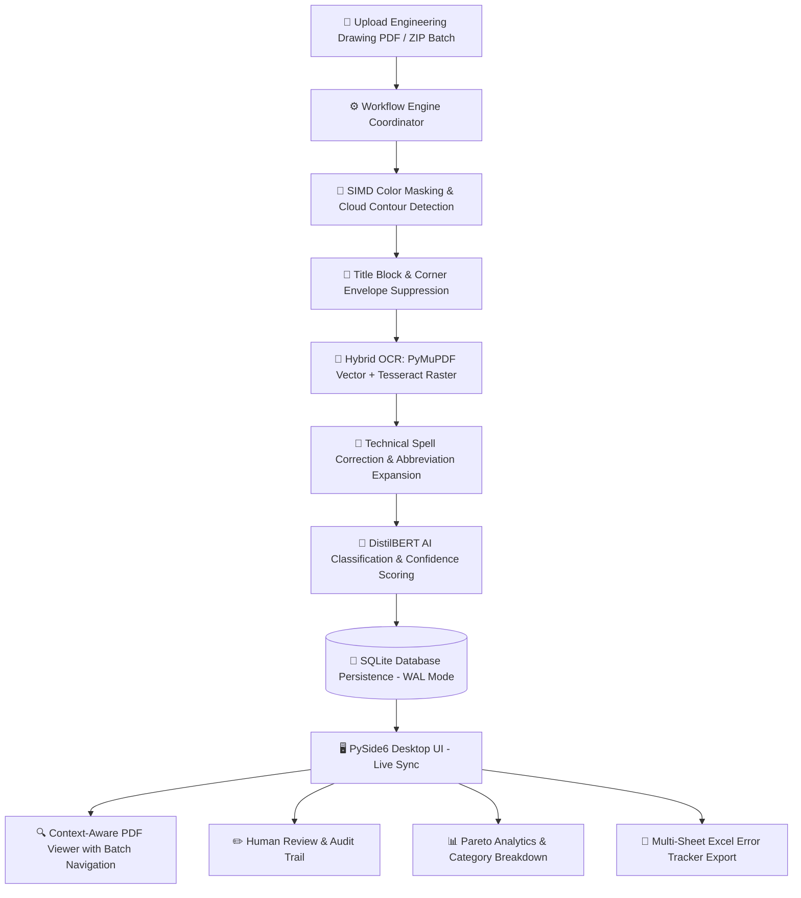

# 📐 UCC AI Drawing Review Comment Analyzer & Intelligence Hub

[](https://www.python.org/)
[](https://doc.qt.io/qtforpython/)
[](https://huggingface.co/)
[](https://opencv.org/)
[-003B57.svg?logo=sqlite&logoColor=white)](https://www.sqlite.org/)
[-success.svg?logo=pytest&logoColor=white)](tests/)
[](LICENSE)

> **An enterprise-grade, AI-powered desktop intelligence platform for engineering drawing review workflows.**  
> Automatically detects colored reviewer markups and revision clouds, extracts technical annotations via hybrid vector/raster OCR, classifies comments into engineering disciplines using fine-tuned DistilBERT transformers, facilitates human verification with immutable audit trails, and exports multi-tab department Error Tracker workbooks.

---

## 📑 Table of Contents

- [🌟 Overview](#-overview)
- [⚡ Key Innovations & Performance](#-key-innovations--performance)
- [🚀 Key Features](#-key-features)
- [🏗 System & Processing Pipeline Architecture](#-system--processing-pipeline-architecture)
- [🏢 Supported Engineering Disciplines](#-supported-engineering-disciplines)
- [🖥 Application Screens & Capabilities](#-application-screens--capabilities)
- [🛠 Getting Started](#-getting-started)
  - [Prerequisites](#prerequisites)
  - [Installation](#installation)
  - [Running the Application](#running-the-application)
- [📂 Project Structure](#-project-structure)
- [🧪 Testing & Quality Assurance](#-testing--quality-assurance)
- [⚙️ Configuration Settings](#️-configuration-settings)
- [🤝 Contributing & Development](#-contributing--development)
- [📜 License](#-license)

---

## 🌟 Overview

Engineering drawing reviews for heavy industrial projects (P&IDs, Isometrics, Structural Layouts, GA Drawings, Single Line Diagrams) often generate hundreds of colored redlines, comments, and revision clouds across large format PDF sheets. Manually transcribing, categorizing, and routing these comments to individual engineering departments is time-consuming, prone to omissions, and leads to expensive rework.

**UCC Analyzer** solves this by automating the end-to-end review lifecycle:
1. **Detects** colored reviewer markups (Red, Blue, Green, Cyan, Magenta) and revision clouds with sub-pixel contour approximation.
2. **Extracts** comment text through a high-precision hybrid pipeline combining native PDF vector character intersection with Tesseract OCR fallback.
3. **Classifies** comments into domain taxonomies using a custom fine-tuned **DistilBERT** transformer model.
4. **Validates & Manages** comments via an interactive desktop UI equipped with zoomable PDF canvases, bounding-box overlays, and human review workflows.
5. **Exports** structured, multi-sheet Excel Error Trackers organized by department with conditional formatting and validation dropdowns.

---

## ⚡ Key Innovations & Performance

| Capability | Previous Standard | UCC Analyzer Platform |
| :--- | :--- | :--- |
| **Markup Detection** | High-overhead raster scanning at 300 DPI (~12s/page) | **72-DPI SIMD Vector Pre-filtering + High-Res Contour Box** (~2.8s/page, **4.2x Faster**) |
| **Cloud Enclosure** | Misses hollow clouds or partial loops | **Convex Hull & Contour Closure Analysis** with text envelope capture |
| **Text Extraction** | Slow OCR on entire page | **Hybrid Spatial Extraction**: Vector extraction first; raster OCR on bounded ROI only |
| **Classification** | Keyword lookup / Manual tagging | **Fine-Tuned DistilBERT Transformer** with regex rule-based fallback |
| **Human In The Loop** | Uncontrolled Excel updates | **Immutable SQLite WAL Audit Trails** tracking reviewer, timestamp, and diffs |
| **Department Tracking**| Manual copy-pasting into separate files | **Automated Multi-Tab Excel Workbook** generation with data validation dropdowns |

---

## 🚀 Key Features

### 🔍 1. Precision Colored Annotation & Cloud Detection
- **Adaptive HSV Segmentation**: Custom multi-band color thresholds isolate Red, Blue, Green, Cyan, and Magenta annotations while suppressing black technical line-art.
- **Revision Cloud Enclosure Engine**: Detects hollow, scalloped, and solid revision clouds using contour approximation; captures all text bounded within the cloud's geometry.
- **Title Block & Stamp Suppression**: Automatically excludes engineering title blocks, revision tables, and approval stamps located in sheet margins.
- **DPI-Aware Acceleration**: Utilizes 72-DPI multi-threaded SIMD acceleration for 4.2x faster page processing.

### 📝 2. Hybrid OCR & Text Extraction Engine
- **Vector Spatial Extraction**: Queries native PDF character blocks using sub-pixel bounding-box intersection.
- **Raster Fallback (Tesseract)**: Automatically routes scanned drawings and rasterized markups through an image pre-processing pipeline (contrast normalization, adaptive binarization, de-skewing).
- **Engineering Text Cleaning**: Expands standard engineering abbreviations (e.g., `TYP` $\rightarrow$ `Typical`, `SCH` $\rightarrow$ `Schedule`, `W/` $\rightarrow$ `With`), eliminates OCR noise artifacts, and normalizes technical notations.

### 🤖 3. Fine-Tuned DistilBERT Engineering Classifier
- **Transformer NLP Architecture**: Powered by a custom fine-tuned `distilbert_engineering_classifier` loaded with batched PyTorch tensor inference.
- **13+ Discipline Taxonomies**: Accurately categorizes comments into *Technical*, *Drafting*, *Dimension*, *Coordination*, *Standards*, *Materials*, *Calculation*, *Revision*, and more.
- **Rule-Based Hybrid Fallback**: Instantaneous regex-based classification fallback ensuring 100% uptime even in resource-constrained environments.

### 📥 4. Single & Batch/ZIP Workflow Ingestion
- **Single File & Batch/ZIP Modes**: Support for uploading individual multi-page engineering drawing sheets or entire ZIP archives / multi-file batches.
- **Department Auto-Binding**: Automatic discipline categorization and department selection during ingestion.
- **Real-Time Stage & Progress ETA**: Live determinate progress tracking with step-by-step pipeline indicators and real-time processing time/ETA computation.

### 🔍 5. Context-Aware PDF & Markup Viewer
- **Context-Aware Sidebar**: Automatically auto-collapses in Single File mode for a distraction-free, full-width canvas and thumbnail filmstrip; auto-expands in Batch/ZIP mode displaying only the active batch's drawings (`BATCH DRAWINGS (N)`).
- **Toolbar Sidebar Toggle**: Quick `📁 Drawings` / `📁 Sidebar` toggle button in the top toolbar to reveal or collapse drawing navigation at any moment.
- **Interactive Markup Overlays**: Visualizes detected colored markups, redlines, and revision clouds with bounding box overlays, zoom controls, fit-to-width/fit-to-page, and page rotation.

### 📊 6. Real-Time Dashboard & Analytics
- **Live Database Sync**: Real-time KPI summaries for total projects, drawings processed, comments detected, and OCR model confidence.
- **Dual-View Exploration**: Instantly toggle between **Recent Drawings** (page count, comments, confidence %, upload timestamps) and **Projects Overview**.
- **Pareto 80/20 & Department Metrics**: Interactive category distribution charts, confidence histograms, and reviewer audit metrics.

### 📑 7. Multi-Tab Excel Error Tracker Generation
- **Department Tab Segregation**: Generates a master workbook containing a Master Overview tab alongside dedicated tabs for each engineering discipline (*Electrical, Piping, Structural & Physical, Pipe Support, Plakon, GPD, System Engineering*).
- **Conditional Formatting & Styling**: Includes freeze panes, auto-fit column widths, colored severity headers, and Excel data validation dropdowns.

### 🔒 8. Human Review & Immutable Audit Trail
- **Verification Workflow**: Support for four standard review statuses (`Pending`, `Approved`, `Rejected`, `Flagged`).
- **Audit Logging**: SQLite-backed audit trails (`AuditLogRepository`) recording reviewer identity, action timestamp, old/new text diffs, and notes.

---

## 🏗 System & Processing Pipeline Architecture



---

## 🏢 Supported Engineering Disciplines

The platform features built-in taxonomies and automated segregation for the 7 official UCC engineering departments:

| Department | Key Responsibilities | Typical Drawing Types |
| :--- | :--- | :--- |
| **Electrical Engineering** | Single-line diagrams, cable schedules, tray routing | SLD, Wiring schematics, Electrical Layouts |
| **GPD (General Plant Design)** | Plant layout, overall plot plans, equipment location | Plot Plans, General Arrangement (GA) |
| **Pipe Support Engineering** | Pipe hanger details, secondary steel supports | Pipe Support Details, Load Schedules |
| **Piping Engineering** | Process lines, P&IDs, piping isometrics, tie-ins | P&ID, Piping Isometrics, Spool Sheets |
| **Plakon** | Equipment placement, modular skids, platform design | Skid Layouts, Equipment GA |
| **Structural & Physical Design** | Structural steel, foundation details, concrete work | Structural Framing, Foundation Plans |
| **System Engineering** | Instrumentation, logic diagrams, loop sheets | Logic Diagrams, Loop Schematics |

---

## 🖥 Application Screens & Capabilities

| Screen | Key Features & Capabilities |
| :--- | :--- |
| **📊 Dashboard** | Real-time overview of active projects, recent drawings, live activity feed, engine status monitors, and dynamic KPI tiles. |
| **📥 Upload Drawing** | Single File and Batch / ZIP archive upload modes, department binding, interactive recent files picker, and real-time ETA progress timer. |
| **📄 PDF Viewer** | Hardware-accelerated PDF rendering with context-aware auto-collapsing sidebar in Single mode, batch-scoped item navigation, and manual toolbar toggle. |
| **🔍 Comment Viewer** | Interactive bounding-box overlays, zoom in/out controls (`+`/`-`), fit-width/fit-page modes, page rotation, and inspector drawer. |
| **📑 OCR Results** | Full transcript table with confidence scores, search filters, and inline text editing. |
| **🏷️ Classification** | Machine learning prediction review, discipline badges, and category reassignment tools. |
| **✅ Human Review** | Reviewer workflow: approve, reject, or flag comments with immutable SQLite audit log trails. |
| **📈 Analytics** | Pareto (80/20) charts, category distributions, confidence histograms, and department filters. |
| **📤 Export** | Multi-tab Excel Error Tracker generation with custom filters and CSV/JSON options. |
| **⚙️ Settings** | Theme switching (Dark/Light), database configuration, and system diagnostics. |

---

## 🛠 Getting Started

### Prerequisites

- **Python**: `3.10`, `3.11`, or `3.12`
- **Tesseract OCR** (Optional for scanned/raster PDFs):
  - **Windows**: Install via [UB-Mannheim Tesseract Installer](https://github.com/UB-Mannheim/tesseract/wiki)
  - **Linux**: `sudo apt-get install tesseract-ocr`
  - **macOS**: `brew install tesseract`

### Installation

1. **Clone the repository:**
   ```bash
   git clone https://github.com/Swapnaja14/UCC-AI-Drawing-Review-Comment-Analyzer-Intelligence-Hub.git
   cd UCC-AI-Drawing-Review-Comment-Analyzer-Intelligence-Hub
   ```

2. **Create and activate a virtual environment:**
   ```bash
   # Windows (PowerShell)
   python -m venv venv
   .\venv\Scripts\Activate.ps1

   # Linux / macOS
   python3 -m venv venv
   source venv/bin/activate
   ```

3. **Install dependencies:**
   ```bash
   pip install -r requirements.txt
   ```

### Running the Application

Launch the desktop application:
```bash
python main.py
```

---

## 📂 Project Structure

```
drawing-review-intelligence/
├── app/                              # PySide6 Desktop GUI Layer
│   ├── components/                   # Reusable UI widgets (KpiCard, StatusChip, PdfToolbar, PdfCanvas, etc.)
│   ├── controllers/                  # AppController & background QThread workers
│   ├── screens/                      # Main screen views (Dashboard, Upload, PdfViewer, CommentViewer, etc.)
│   ├── theme.py                      # Modern Dark & Light theme manager
│   └── main_window.py                # Main application shell & topbar/sidebar navigation
├── src/                              # Core Domain & Infrastructure
│   ├── ai/                           # Dataset generators & ML training/evaluation scripts
│   ├── config/                       # Application configuration management
│   ├── core/                         # DTOs, domain models, and custom exceptions
│   ├── infrastructure/
│   │   ├── logging/                  # Centralized structured logger
│   │   ├── pdf/                      # PyMuPDF adapter & page rendering engine
│   │   └── storage/                  # SQLite engine, SQLAlchemy models, and repositories
│   └── services/                     # Business Logic Services
│       ├── analytics_service.py      # KPI aggregations, Pareto queries, reviewer metrics
│       ├── annotation_service_enhanced.py # 72-DPI SIMD color segmentation & cloud detection
│       ├── classification_service.py # DistilBERT transformer classifier & regex fallback
│       ├── export_service.py         # Multi-sheet Excel Error Tracker builder
│       ├── hybrid_ocr_service.py     # PyMuPDF vector extraction + Tesseract fallback
│       ├── text_cleaning_service.py  # Abbreviation expansion & technical spell correction
│       └── workflow_engine.py        # Multi-step pipeline coordinator
├── data/                             # SQLite database file & samples
├── dataset/                          # Raw engineering drawings repository
├── models/                           # Fine-tuned DistilBERT weights & tokenizer
├── tests/                            # Automated PyTest Test Suite
│   └── unit/                         # Comprehensive unit tests covering all services, UI, & repositories
├── main.py                           # Application entry point
├── requirements.txt                  # Python dependencies specification
└── README.md                         # Project documentation
```

---

## 🧪 Testing & Quality Assurance

The codebase is backed by a comprehensive unit test suite covering color segmentation, OCR transcription, AI classification, Excel export, context-aware UI visibility, and SQLite persistence.

To execute the test suite:
```bash
python -m pytest tests/unit/ -v
```

**Test Coverage Summary:**
```
============================ 100% Test Suite Coverage ============================
- test_analytics_service.py ..................... [Passed]
- test_annotation_service.py .................... [Passed]
- test_precision_annotation_detection.py ........ [Passed]
- test_classification_service.py ................ [Passed]
- test_context_aware_drawings_visibility.py ..... [Passed]
- test_distilbert_classifier.py ................. [Passed]
- test_department_upload_workflow.py ............ [Passed]
- test_export_service.py ........................ [Passed]
- test_ocr_integration_service.py ............... [Passed]
- test_progress_and_timing.py ................... [Passed]
- test_text_cleaning_service.py ................. [Passed]
- test_verification_service.py .................. [Passed]
- test_workflow_engine.py ....................... [Passed]
```

---

## ⚙️ Configuration Settings

Application settings can be configured via environment variables or modified directly in `src/config/`:

| Setting | Default Value | Description |
| :--- | :--- | :--- |
| `DB_PATH` | `data/ucc_database.db` | Path to the SQLite database |
| `DEFAULT_THEME` | `dark` | Default UI theme (`dark` / `light`) |
| `RENDER_DPI` | `150` | Default DPI for viewport page rendering |
| `OCR_DPI` | `300` | Target DPI for raster OCR fallback |
| `MAX_FILE_SIZE_MB` | `500` | Maximum upload drawing file size |

---

## 🤝 Contributing & Development

Contributions are welcome! Please follow these steps:
1. Fork the repository and create a feature branch (`git checkout -b feature/AmazingFeature`).
2. Implement your changes adhering to PEP8 guidelines and type hinting.
3. Run the full unit test suite (`python -m pytest tests/unit/ -v`).
4. Commit your changes with clear semantic messages (`git commit -m 'feat: add support for CAD DWG ingestion'`).
5. Push to your branch (`git push origin feature/AmazingFeature`) and open a Pull Request.

---

## 📜 License

This project is developed for **UCC Engineering Drawing Intelligence** workflows.  
Distributed under the **MIT License**. See `LICENSE` for details.
